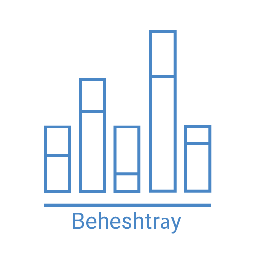
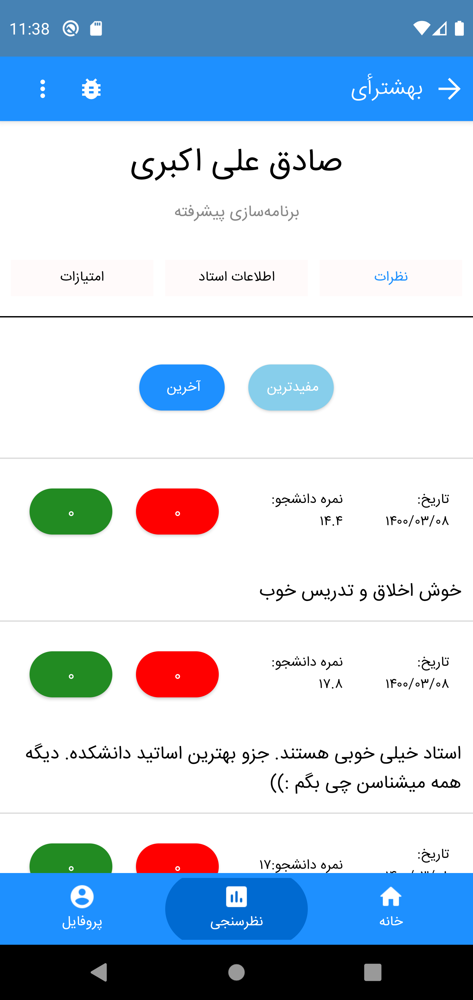
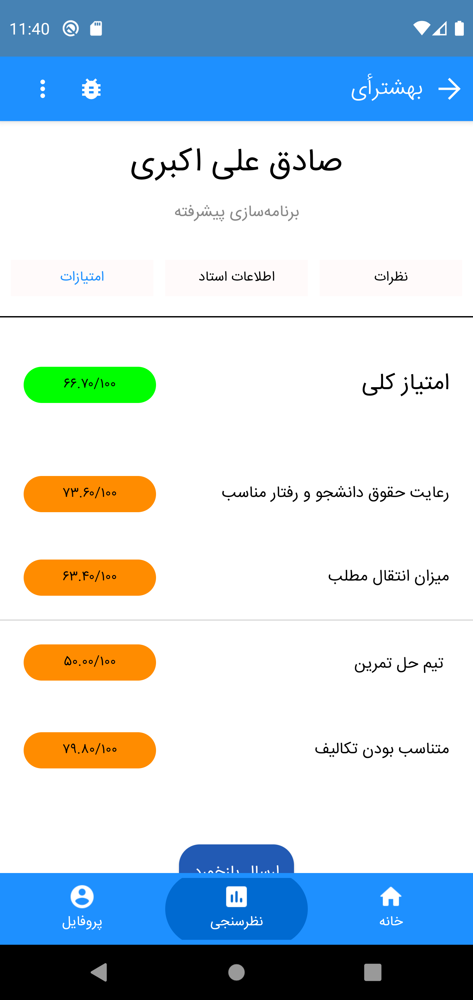
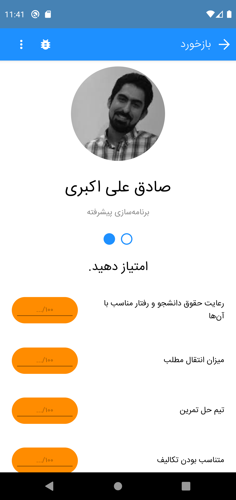
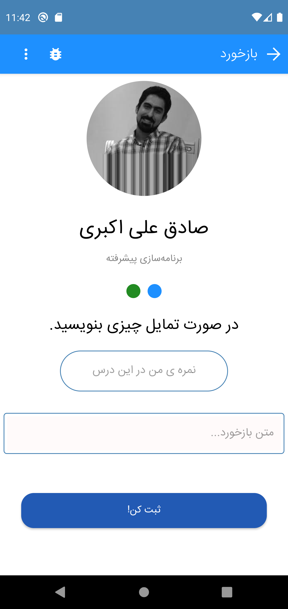
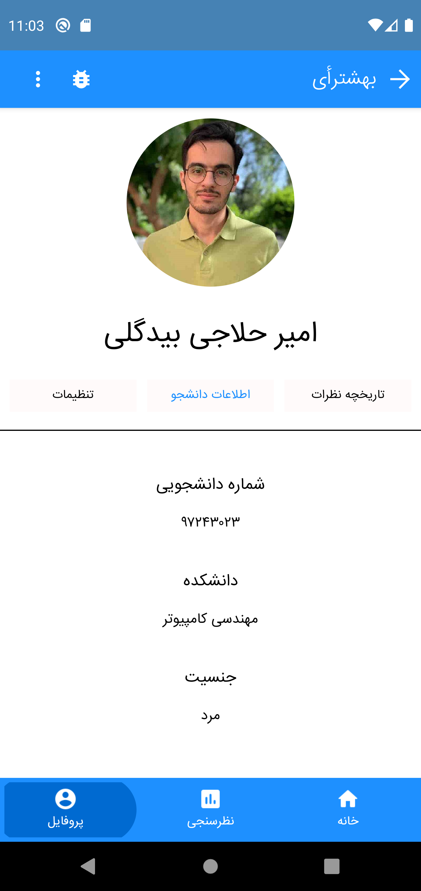
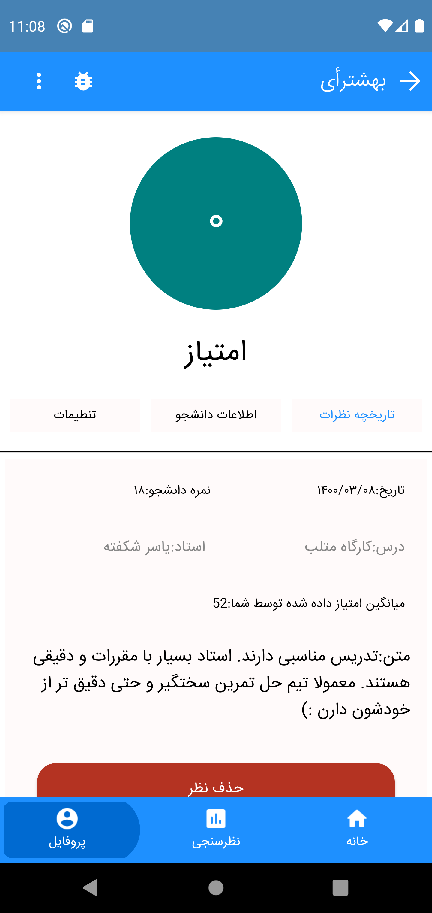

<h2 align="center">Beheshtray Polling Service</h2>

### Introduction
Beheshtray is a application in which you can read and write comments about Shahid Beheshti university teachers. The users of the application can upvote or downvote your comment based on what you've submitted.
Below is a brief introduction showing an abstraction of what our app can do.

### Login page
In case you have an appsan account, you can use that to log in. Otherwise, you have to create an account.

### Home page
In the home page, you can see the most popular teachers based on the comments received from the users. Also, you can see the list of the **Best TAs**, **the most and least comments** and **the most populars**.

### Teacher Page
In teacher page, you can see the teacher information, the list of feedbacks received and also the average scores  from users.

### Sending feedback
In this page, you can send your feedback.

### Profile Page
You have a profile page in which you can see your information and your comment histories. You can also delete your comments and see the total scores of your feedbacks.

### How to install
In case to run our app, you first have install appsan on your android phone and then run **Beheshtray** from there.

| Version | Release                                                                 |
|---------|-------------------------------------------------------------------------|
|  v 0.1.9 | [click here to download](https://s19.picofile.com/file/8435427150/shahidbeheshti_V0_1_9.apk.html) |

### Contributers
- [Mohammad Khoddam](https://github.com/mkh2097) (**UI-UX / Front-end / Back-end**)
- [Amir Hallaji](https://github.com/amirhallaji) (**Back-end**)
- [Arman Hosseinmardi]() (**Back-end**)
- [Ali Rezasoltani]() (**Front-end**)

